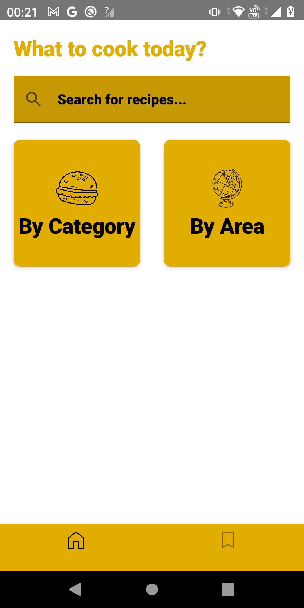
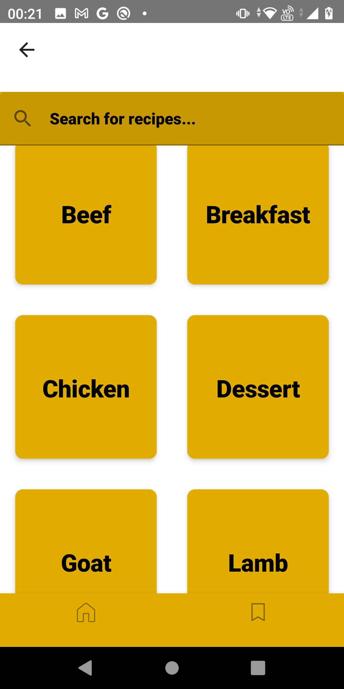
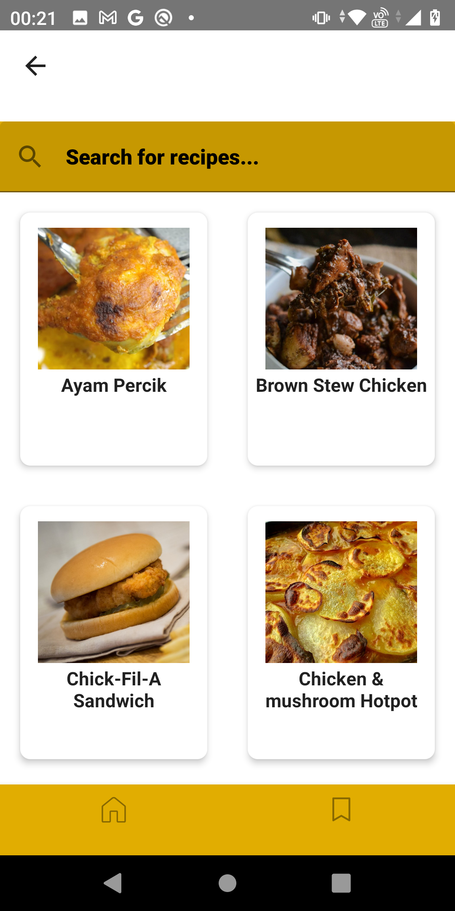
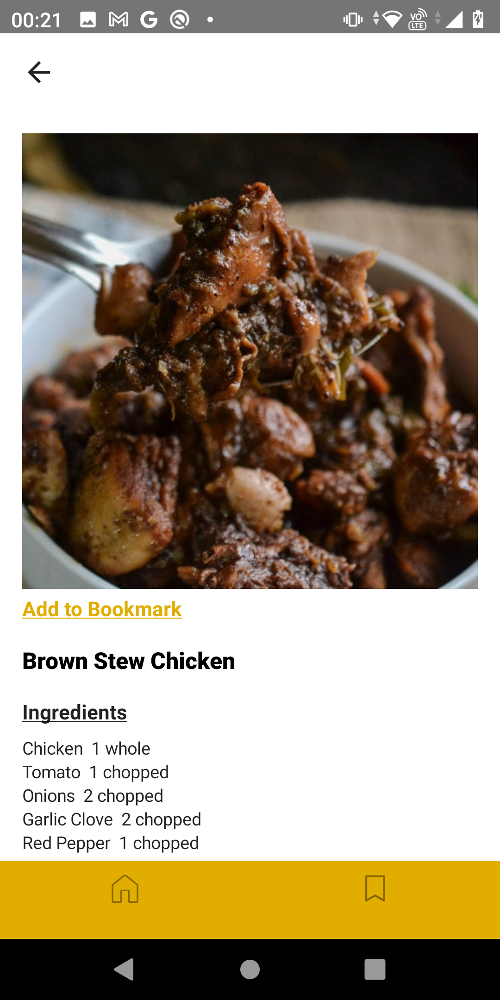
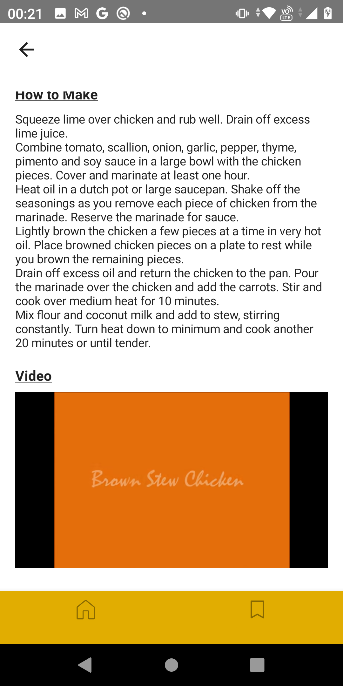
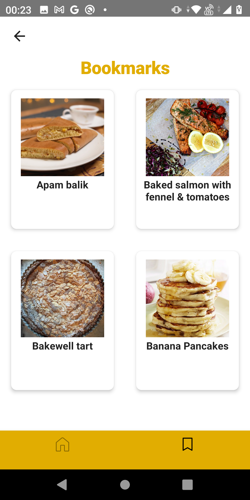

<h1 align="center">Mealicious</h1>
<h3 align="center">An Android Recipe Application</h3>
 

## About
Mealicious is an app that allows you to lookup recipes based on its category or its area of origin. You're able to look at recipe details, watch youtube tutorial videos, and also save your favorite recipes to your bookmarks to access offline!

## What was used
- Kotlin
- MVVM Design pattern
- themealdb API
- Jetpack Compose
- Dagger-Hilt
- Room Database

## Screenshots

## Author
* <b>Nabila Fakhirah</b>
* Email: nabilafakhirah@gmail.com
   